# Введение

В рамках выполнения практического задания был создан сервис заметок.
Данный сервис является прототипом, Proof Of Concept, подтверждающий мои навыки,
а так же техническую возможность создания такого WEB приложения.

Реализованы основные функции:
- Регистрация пользователей
- Авторизация пользователей
- Отображение списка заметок
- Возможность создать новую заметку
- Возможность удалить заметку
- Возможность просмотреть детали заметки

# Описание

## Структура БД

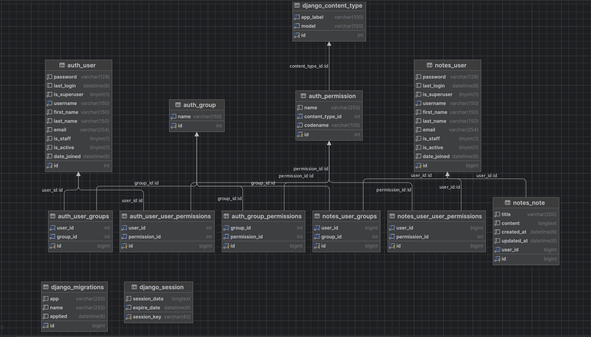

## Главная страница:

На главной странице присутствует:
- Логотип сервиса (кликабельный, с возможность перейти на главную страницу из любой точки сайта)
- Удобное горизонтальное меню в хедере (для навигации по сайту)
- Контент приветствующий пользователя, рассказывающий кратко о сервисе и предлагающий зарегистрироваться или авторизоваться

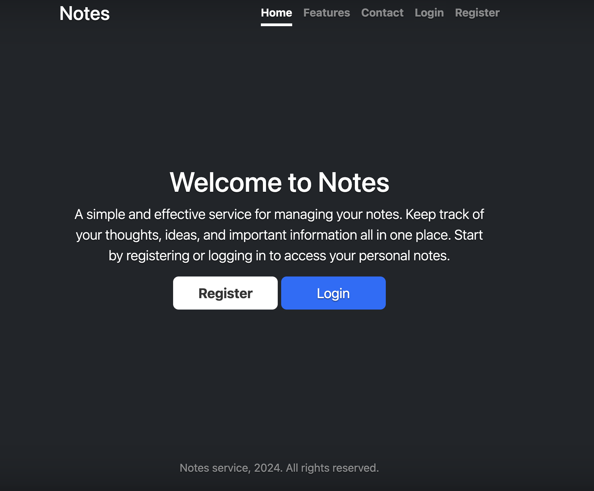

## Страница с описанием функций сервиса

На данной странице пользователь может ознакомиться с доступными функциями предоставляемые сервисов.

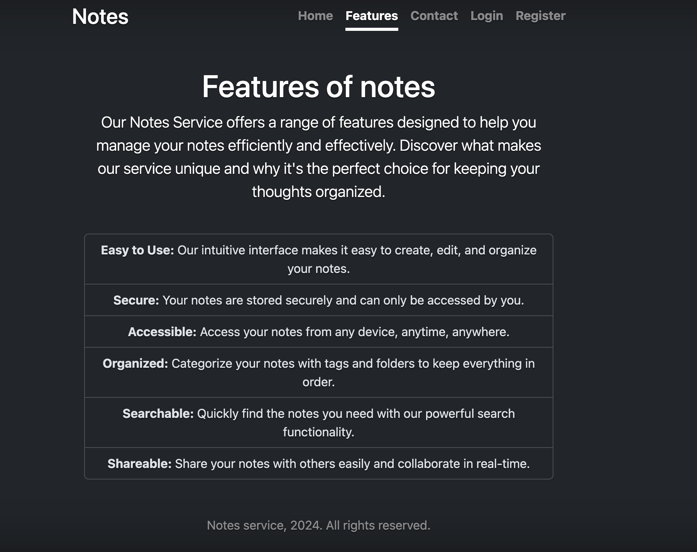

## Страница с контактами

На данной странице пользователь может ознакомиться с контактми сервиса.

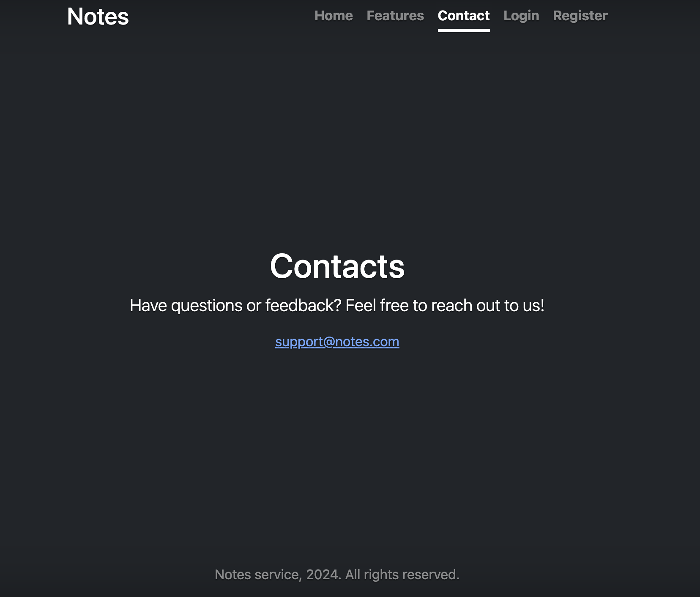

## Страница регистрации

На странице регистрации пользователь может создать себе учетную запись в сервисе.

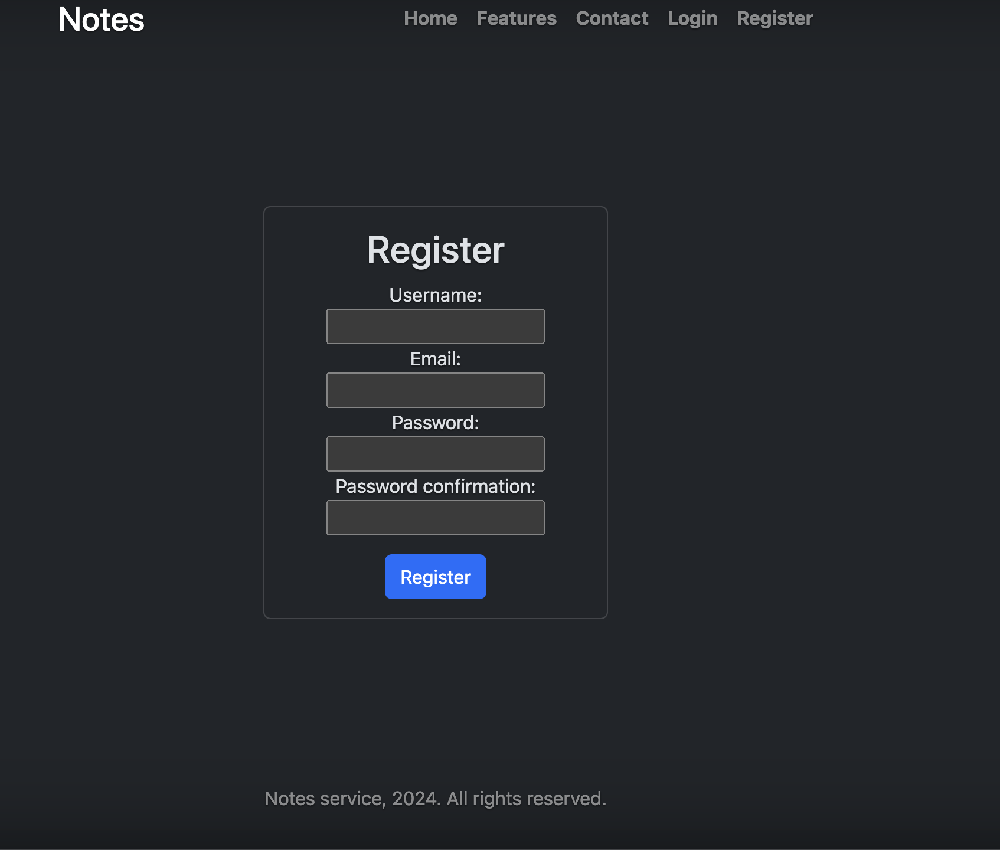

В форме регистрации имеется валидация вводимых данных.

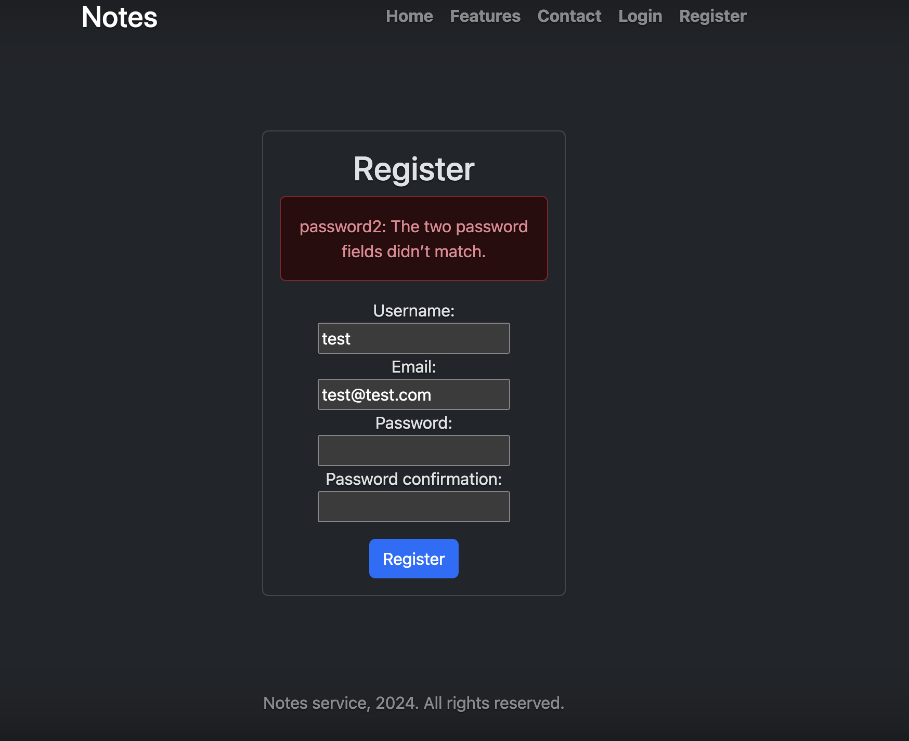

## Страница авторизации

На странице авторизации пользователь может создать авторизоваться в сервисе.

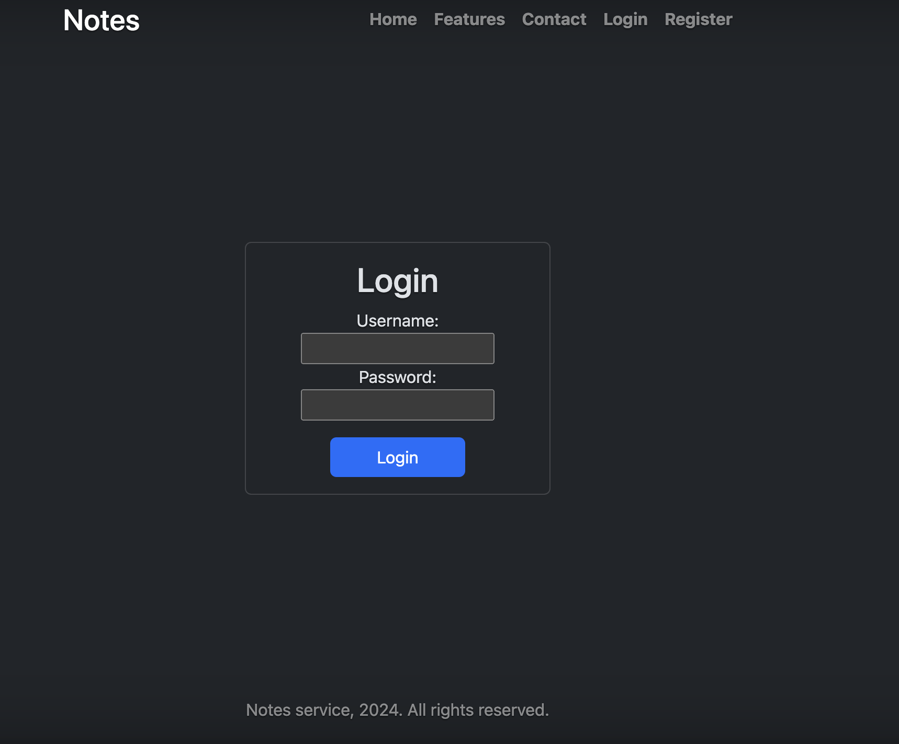

В форме авторизации имеется валидация вводимых данных.

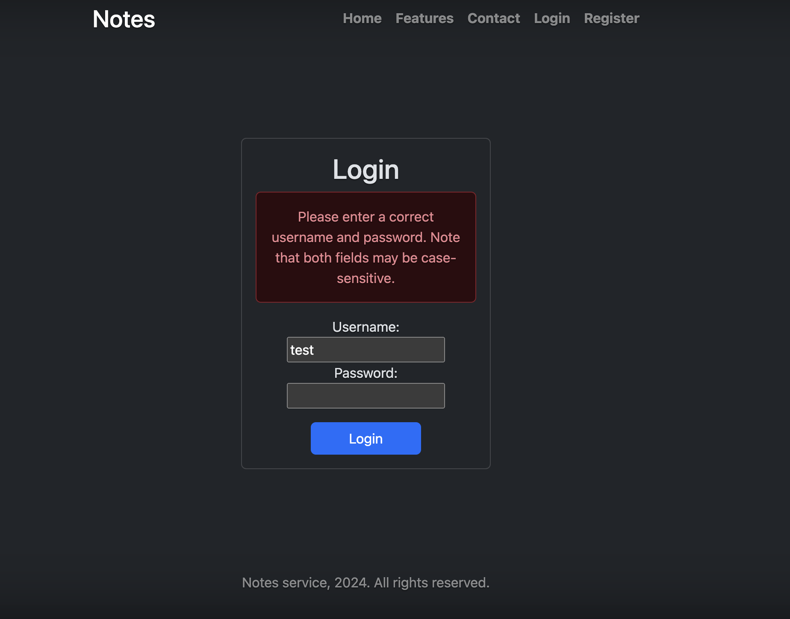

## Навигация авторизованного пользователя

После авторизации пользователя в главном меню сверху появляется дополнительня навигация
с именем пользователя и возможность выхода из системы.

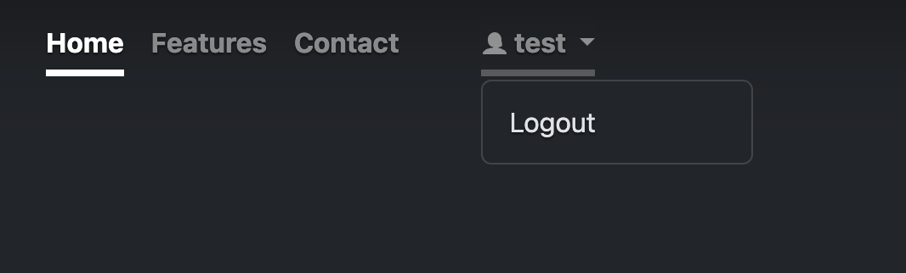

## Список заметок

Авторизованный пользователь имеет возможность увидеть список своих заметок.

Дополнительно имеется возможность: 
- просмотреть любую заметку
- удалить любую заметку
- создать новую заметку

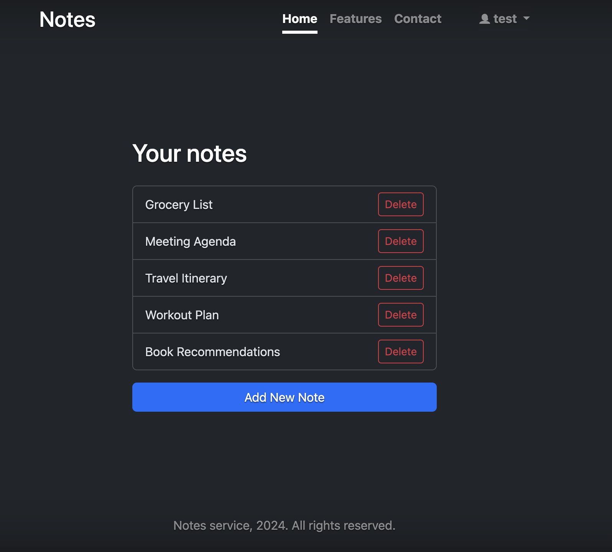

## Страница просмотра деталей заметки

Авторизованный пользователь имеет возможность посмотреть детали любой своей заметки.

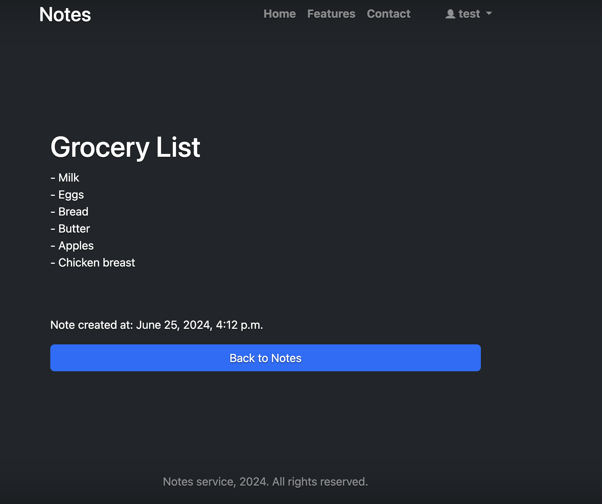

## Страница добавления новой заметки

Авторизованный пользователь имеет возможность добавить новую заметку.

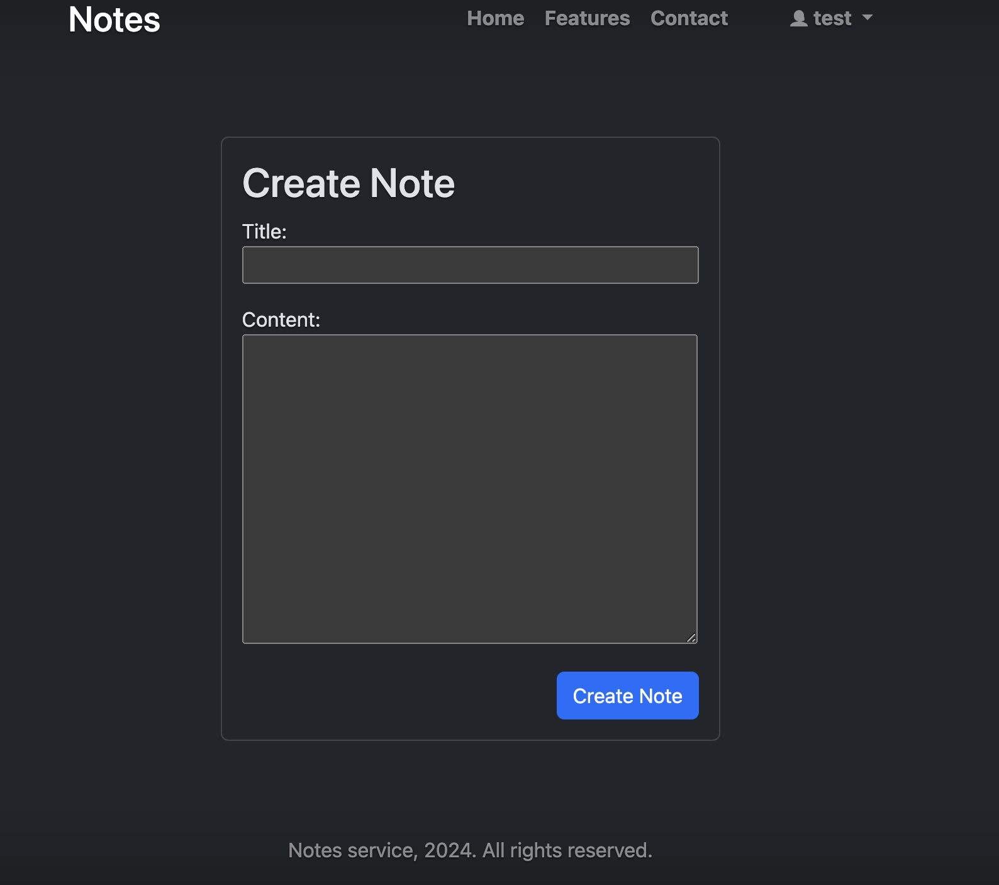